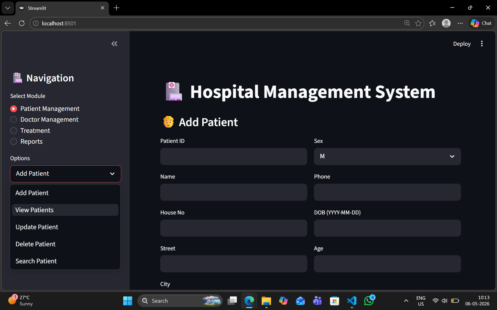
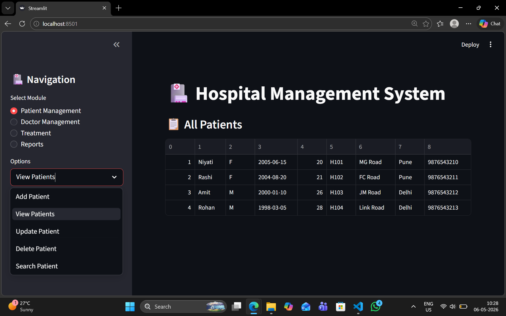
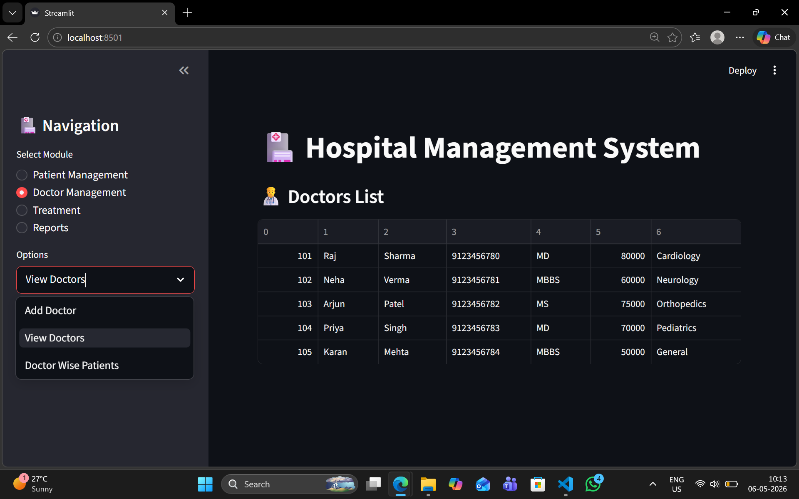
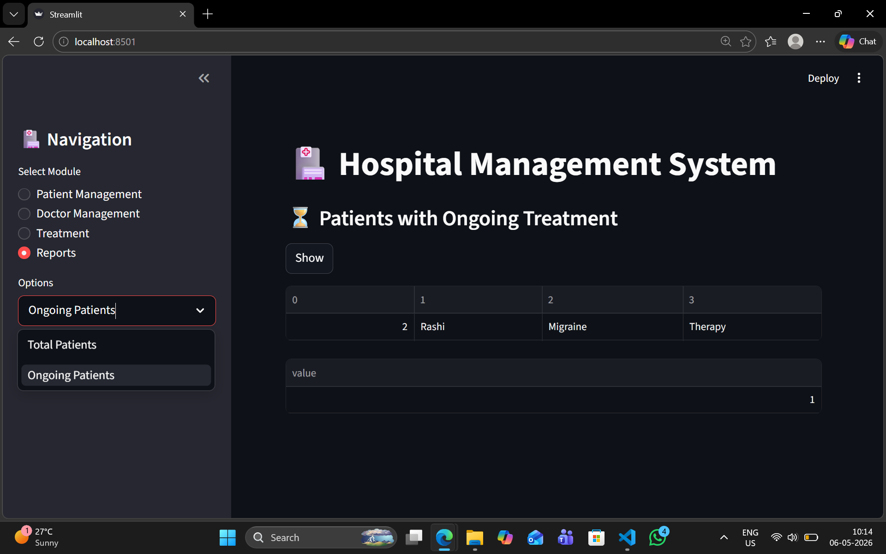
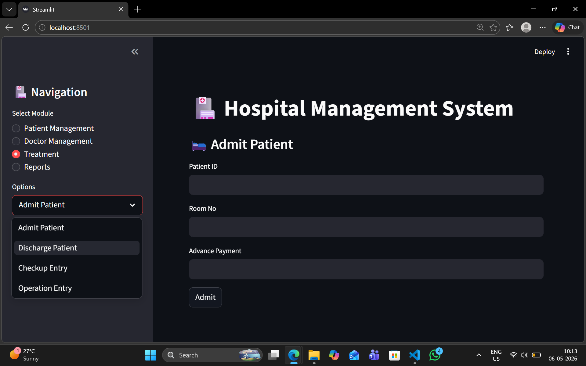

# Hospital_Management_System_DBMS_proj
DBMS Mini Project: A Hospital Management System to manage patients, doctors, appointments using structured database design and SQL operations.
This project demonstrates strong understanding of **DBMS concepts, SQL programming, and database-driven application development**.

---

## Features

### Patient Management
- Add, update, delete, and search patients
- View complete patient details including history
- Automatic **age calculation using SQL function**

### Doctor Management
- Add and view doctors
- Assign doctors to departments
- View **doctor-wise patient records using stored procedures**

### Treatment Management
- Admit patients with advance payment validation
- Discharge patients with billing details
- Record checkups and operations

### Reports & Analytics
- Total number of patients (SQL Function)
- List of patients with ongoing treatments (Stored Procedure)

### Data Integrity & Automation
- Constraints (PRIMARY KEY, FOREIGN KEY, CHECK, UNIQUE)
- Trigger to **backup patient data before deletion**
- Trigger to **validate advance payment**

---

## DBMS Concepts Used

- Relational Database Design
- Entity Relationships (ER Model)
- Normalization (up to 3NF)
- Primary & Foreign Keys
- Constraints & Data Validation
- Joins & Queries
- **Triggers**
- **Stored Procedures**
- **Functions**
- Cursor-based processing

---

## Tech Stack

- **Frontend / UI**:
  - Streamlit (Python)

- **Backend**:
  - Python (mysql-connector)

- **Database**:
  - MySQL

- **Tools Used**:
  - MySQL Workbench
  - VS Code

---

## Database Schema

### Tables:
- `DEPARTMENT`
- `PATIENT`
- `DOCTORS`
- `PATIENT_ADMIT`
- `PATIENT_DISCHARGED`
- `CHECK_UP`
- `OPERATE_ON`
- `PATIENT_BACKUP`

### Advanced Features:
- Trigger: Backup patient before delete
- Trigger: Validate advance payment
- Function: CalculateAge()
- Function: TotalPatients()
- Procedure: GetDoctorPatients_WithCount()
- Procedure: GetOngoingPatients()

---

## 📸 Screenshots

### 🔹 Dashboard


### 🔹 Patient Management


### 🔹 Doctor Management


### 🔹 Reports


### 🔹 Treatment


---

## ⚙️ Setup & Installation

### 1️⃣ Clone Repository
```bash
git clone https://github.com/Shraddha814/Hospital_Management_System_DBMS_proj.git
cd hospital-management-system
